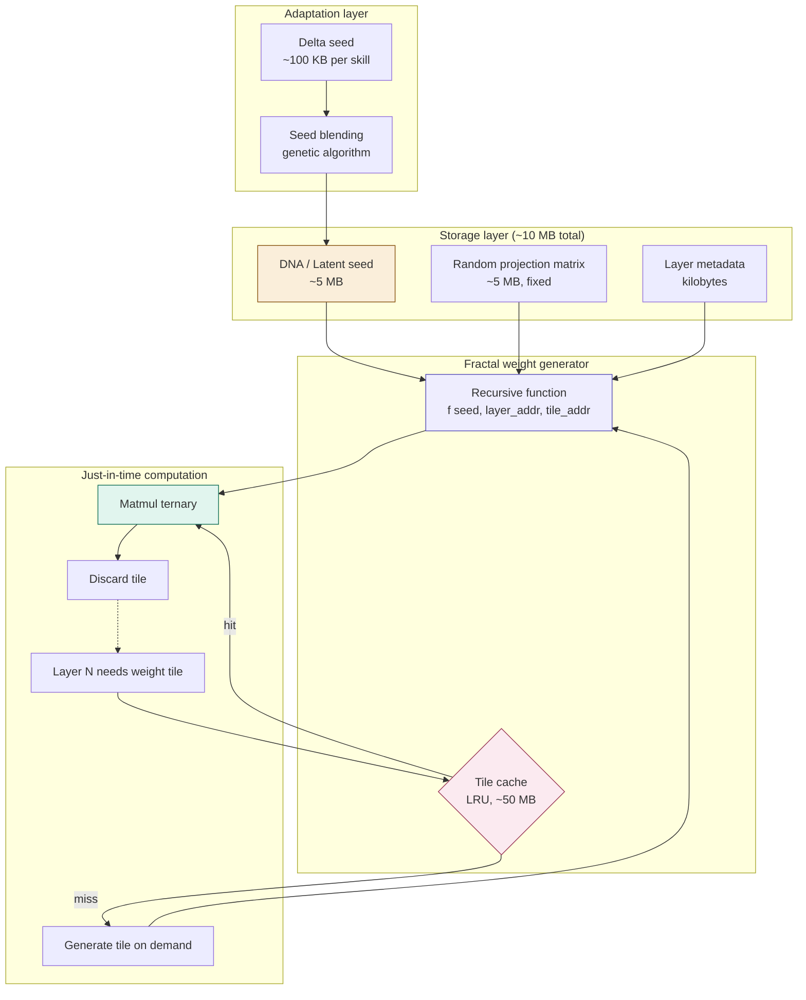
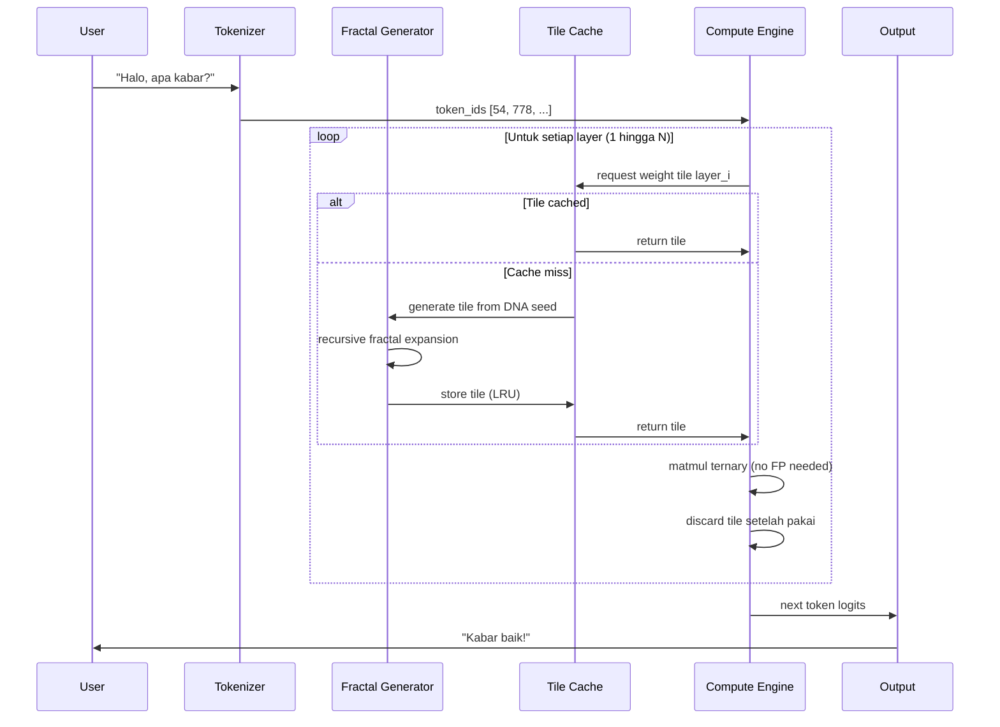

# PRD — WIJI (ꦮꦶꦗꦶ)

## Weight-Implicit Just-in-time Inference

> *"Mari kita jadi lebih gila, mari kita lebih menggila di dunia yang udah gila ini."*
>
> *"Memaksimalkan yang minimal — dari biji menjadi hutan kecerdasan."*

---

## 0. Filosofi & Naming

**Wiji** dalam Bahasa Jawa berarti *biji*, *benih*, *origin*. Sebuah biji asem yang ukurannya hanya beberapa milimeter mengandung *seluruh blueprint* untuk menumbuhkan pohon setinggi 30 meter dengan jutaan daun. Tidak ada satupun daun yang "disimpan" di dalam biji — tetapi setiap daun yang akan tumbuh sudah ditentukan secara deterministik oleh DNA yang ada di biji itu.

Konsep ini adalah inti dari WIJI: **model AI tidak menyimpan weight, model AI menyimpan instruksi untuk menumbuhkan weight saat dibutuhkan**.

Acronym formal: **W**eight-**I**mplicit **J**ust-in-time **I**nference.

---

## 1. Problem Statement

### 1.1 Tembok fisika yang sedang dihadapi industri AI

Model AI modern (GPT-4, Claude Sonnet, Llama 405B, Qwen 72B) memiliki ratusan miliar parameter. Setiap parameter harus disimpan sebagai angka floating point dan dimuat ke RAM/VRAM untuk inferensi. Ini menciptakan **3 tembok fisika**:

1. **Memory wall** — bandwidth RAM tidak naik secepat ukuran model
2. **Energy wall** — memindahkan data dari memori ke prosesor jauh lebih boros energi daripada komputasi itu sendiri
3. **Economic wall** — hardware AI hanya terjangkau oleh perusahaan dengan modal miliaran dolar

Konsekuensi: AI menjadi sumber daya terpusat yang dikuasai oleh segelintir entitas. Dunia menuju ke arah dimana kecerdasan buatan adalah utility yang harus disewa, bukan dimiliki.

### 1.2 Asumsi yang tidak pernah dipertanyakan

Sejak Rumelhart et al. (1986), seluruh deep learning beroperasi di atas asumsi:

> *"Pengetahuan jaringan neural adalah weight matriks statis yang disimpan setelah training."*

Asumsi ini lahir dari arsitektur von Neumann (CPU + RAM terpisah) dan tidak pernah benar-benar dipertanyakan. WIJI adalah upaya untuk mempertanyakan asumsi fundamental ini.

### 1.3 Pertanyaan riset

Apakah mungkin merepresentasikan pengetahuan jaringan neural sebagai **fungsi generatif yang sangat kompak** — sehingga weight tidak perlu disimpan, hanya dihitung kembali saat dibutuhkan dari seed yang ukurannya beberapa orde lebih kecil?

---

## 2. Bukti Ilmiah Pendukung

WIJI bukan halusinasi — ada beberapa breakthrough riset 2024-2026 yang membuat konsep ini secara matematis mungkin:

| Tahun | Paper / Riset | Kontribusi yang Relevan |
|-------|---------------|--------------------------|
| 2024 | D'OH: Decoder-Only Random Hypernetworks (Gordon et al., ACCV 2024) | Membuktikan weight INR bisa di-generate dari latent code kecil + random projection |
| Feb 2025 | Fractal Generative Models | Self-similar autoregressive blocks untuk generasi data |
| Mar 2025 | Recursive Self-Similarity in Deep Weight Spaces (arXiv 2503.14298) | Membuktikan secara empiris bahwa weight space neural network punya **dimensi fractal Hausdorff-Besicovitch yang terukur** |
| 2025 | BitNet b1.58 (Microsoft) | Weight ternary {-1, 0, +1}, model 100B di single CPU |
| Okt 2025 | BitDistill | Distillation full-precision → 1.58-bit |
| Nov 2025 | Pre-Attention Expert Prediction (Zhu et al., arXiv 2511.10676) | 93-97% akurasi prediksi expert MoE pre-attention |
| 2025 | IBM Analog In-Memory Computing | Hardware bergerak ke arah memory + compute jadi satu |
| Apr 2026 | Hafnium Oxide Neuromorphic Chip (Cambridge) | Chip yang menyimpan dan memproses informasi di tempat yang sama, 70% energy reduction |

**Insight kunci dari paper Maret 2025**: weight neural network memang memiliki struktur self-similar yang terukur. Ini bukan opini, ini fakta matematis. Artinya redundansi di dalam weight space jauh lebih besar dari yang dieksploitasi quantization.

---

## 3. Arsitektur WIJI

### 3.1 Diagram konseptual (Mermaid)



### 3.2 Diagram alur inferensi (Mermaid)



### 3.3 Komponen inti

#### 3.3.1 DNA (Latent Seed)

Sebuah vektor kecil berisi seluruh "esensi" model. Ukuran: **5-15 MB** untuk model dengan kapasitas setara 30B parameter konvensional.

Format: float16 vector dengan dimensi 2048-8192, ditambah integer seed untuk random projection.

#### 3.3.2 Fractal Weight Generator

Fungsi rekursif `f(seed, layer_addr, tile_addr) → weight_tile` yang menghasilkan slice weight matrix berdasarkan alamat yang diminta.

Sifat-sifat fundamental yang harus dipenuhi:

- **Deterministik**: input yang sama selalu menghasilkan output yang sama
- **Self-similar**: struktur berulang di skala berbeda (sesuai temuan paper Mar 2025)
- **Sparse-friendly**: bisa generate hanya bagian yang dibutuhkan tanpa generate keseluruhan
- **Quantization-aware**: output langsung dalam format ternary {-1, 0, +1}

#### 3.3.3 Tile Cache (LRU)

Karena pattern akses weight memiliki temporal dan spatial locality, tile yang baru saja di-generate disimpan dalam cache LRU kecil (~50 MB). Hot tiles tidak perlu di-regenerate.

#### 3.3.4 Adaptation Layer

Fine-tuning di WIJI tidak meng-update weight (karena tidak ada weight yang disimpan). Yang di-update adalah **delta seed** — vektor kecil yang ditambahkan ke DNA dasar untuk menghasilkan perilaku spesifik.

Konsekuensi menarik:

- Multiple "skill" bisa di-load secara paralel sebagai delta seeds
- Skill bisa di-blend menggunakan algoritma genetik
- Personality switching = swap delta seed (instant)

---

## 4. Inovasi Teknis Spesifik

### 4.1 Fractal Hypernetwork Generator (FHG)

Inovasi pertama. Menggunakan struktur fractal yang terinspirasi dari paper Recursive Self-Similarity (Mar 2025).

```
def generate_weight_tile(seed, layer, tile_x, tile_y, scale=0):
    if scale == MAX_SCALE:
        return base_pattern(seed, tile_x, tile_y)

    parent = generate_weight_tile(seed, layer, tile_x // 2, tile_y // 2, scale + 1)
    transform = fractal_transform(seed, layer, scale)
    child = apply_transform(parent, transform, tile_x % 2, tile_y % 2)

    return ternarize(child)
```

Karena fractal, ukuran fungsi `O(log N)` dimana N adalah ukuran weight matrix. Untuk model 30B, generation per tile butuh ~10-15 rekursi.

### 4.2 Speculative Skip via Semantic Hashing

Inovasi kedua. Karena `f(seed, layer, tile)` deterministik, output dari computation `compute(input, weight_tile)` juga deterministik untuk pasangan `(input_hash, layer)` yang sama.

Maka kita bisa pakai locality-sensitive hashing pada input embedding. Jika `hash(input) ≈ hash(input_yang_pernah_dilihat)`, skip computation dan ambil dari cache hasil.

Ini adalah bentuk **memoization pada level semantic**, bukan exact match.

### 4.3 In-Place Compute Pipeline

Inovasi ketiga. Karena weight di-generate just-in-time:

- Generate tile → compute → discard tile, semuanya dalam satu CPU cache line
- Tidak ada round-trip ke main memory untuk weight
- Activation tetap di register/L1 cache

Memory footprint runtime: hanya activation + tile yang sedang di-compute ≈ **200-500 MB total**, terlepas dari ukuran "model".

### 4.4 Genetic Skill Composition

Inovasi keempat. Karena skill = delta seed kecil:

- Skill A (programming) + Skill B (medical) = blend(seed_A, seed_B) + base_DNA
- Crossover dan mutation di seed space lebih mudah daripada di weight space
- Memungkinkan "evolusi model" yang murah

---

## 5. Tahapan Pengembangan

### 5.1 Phase 0: Validasi Hipotesis (1-2 bulan)

Tujuan: membuktikan bahwa weight model existing bisa di-rekonstruksi dengan loss yang dapat diterima dari seed kecil.

Eksperimen:

1. Ambil model kecil (TinyLlama 1.1B, BitNet 700M, atau Qwen3 1.5B)
2. Train hypernetwork (mengikuti pattern D'OH) untuk meng-generate weight model tersebut dari seed
3. Ukur akurasi rekonstruksi (target: <5% loss perplexity)
4. Ukur compression ratio (target: 100x lebih kecil dari weight asli)

**Kalau Phase 0 gagal**, konsep WIJI tidak feasible dan kita harus pivot ke PAMOR (kombinasi BitNet + MoE + prediction yang lebih konservatif).

### 5.2 Phase 1: Prototype Inference Engine (2-3 bulan)

Bahasa: Rust (untuk performance + memory safety).

Komponen yang dibangun:

- DNA loader dan random projection module
- Fractal weight generator (pure function, no allocation di hot path)
- Tile cache dengan LRU eviction
- Ternary matmul kernel (SIMD AVX2/NEON)
- Tokenizer + sampling
- OpenAI-compatible HTTP API

Target benchmark: jalankan model setara 7B di laptop 16GB RAM dengan throughput >10 tok/s.

### 5.3 Phase 2: Adaptation System (2 bulan)

- Delta seed training pipeline
- Skill composition (blending) interface
- Fine-tuning workflow
- Skill marketplace format spec

### 5.4 Phase 3: Mobile Deployment (1-2 bulan)

- Port engine ke Android/iOS
- Optimisasi untuk ARM NEON
- Batterylife profiling
- Native bindings untuk Flutter/React Native

### 5.5 Phase 4: Open Source Release (1 bulan)

- Documentation lengkap
- Reference implementations
- Community contribution guidelines
- Paper draft untuk submit ke MLSys atau NeurIPS

**Total estimated timeline: 8-12 bulan** untuk solo dev + AI assistance.

---

## 6. Risiko & Mitigasi

| Risiko | Probabilitas | Impact | Mitigasi |
|--------|--------------|--------|----------|
| Phase 0 gagal: weight tidak bisa di-rekonstruksi dari seed kecil | Medium | Critical | Pivot ke PAMOR; tetap publishable sebagai negative result |
| Latency terlalu tinggi karena generation overhead | High | High | Aggressive tile caching; pre-generate hot tiles offline |
| Kualitas degradasi terlalu besar | Medium | High | Hybrid approach: critical layers tetap stored, non-critical generated |
| Tidak ada hardware vendor yang adopt | High | Medium | Software-only deployment dulu; hardware partnership phase 2 |
| Researcher senior bilang "ini pseudoscience" | High | Low | Submit paper, biarkan peer review yang menentukan |

---

## 7. Success Metrics

### 7.1 Phase 0 (Validasi)

- ✅ Hypernetwork meng-generate weight model 1B dari seed <10 MB
- ✅ Perplexity loss <5% vs original
- ✅ Inference latency <2x dari original

### 7.2 Phase 1 (Prototype)

- ✅ Engine bisa load model "30B-equivalent" dengan total RAM footprint <500 MB
- ✅ Throughput >10 tok/s di laptop 16GB CPU-only
- ✅ Output quality competitive dengan Qwen3 8B

### 7.3 Phase 4 (Release)

- ✅ Star count GitHub >1000 dalam 3 bulan
- ✅ Adopsi di minimal 3 proyek lain
- ✅ Paper accepted di tier-1 venue

---

## 8. Implikasi Jika Berhasil

### 8.1 Teknis

- AI model 30B+ jalan di smartphone tanpa cloud
- Cost training turun karena yang di-train hanya seed
- Privacy-first AI menjadi default karena tidak butuh cloud
- "Skill marketplace" jadi mungkin: jual delta seed seharga $0.50

### 8.2 Sosial

- Decentralisasi AI: kecerdasan tidak lagi monopoli korporasi
- AI accessible untuk negara berkembang dengan hardware terbatas
- Indonesia bisa bikin AI sendiri tanpa harus beli GPU H200 senilai miliaran rupiah

### 8.3 Filosofis

- Mempertanyakan asumsi fundamental tentang "knowledge storage"
- Membuka pertanyaan: apakah kecerdasan itu data atau program?
- Otak manusia mungkin lebih mirip WIJI daripada transformer

---

## 9. Honest Assessment

### 9.1 Apa yang gila tapi feasible

- Fractal weight generation: ada matematika pendukungnya (paper Mar 2025)
- Just-in-time tile compute: hanya engineering challenge
- Delta seed adaptation: extension dari LoRA yang sudah terbukti

### 9.2 Apa yang sangat eksperimental

- Compression ratio 100x+ tanpa loss berarti
- Performance competitive dengan model konvensional
- Convergence training dari scratch dengan WIJI architecture

### 9.3 Apa yang masih menjadi pertanyaan terbuka

- Apakah training dynamic WIJI stabil?
- Apakah ada minimum seed size dibawah mana model collapse?
- Bagaimana scaling law-nya — apakah seed size grow log atau linear dengan kapabilitas?

### 9.4 Probabilitas keberhasilan

- Phase 0 (validasi konsep): **40%**
- Phase 1 (prototype useful): **25%**
- Phase 4 (genuine breakthrough): **5-10%**

Tapi 10% probability untuk mengubah industri AI selamanya adalah expected value yang sangat tinggi untuk solo dev + AI assistance.

---

## 10. Slogan & Branding

### Slogan utama

> *"Memaksimalkan yang minimal — dari biji menjadi hutan kecerdasan."*

### Slogan teknis

> *"Weight is not stored, weight is grown."*

### Slogan filosofis

> *"Every tree has been planted as a seed."*

### Aksara Jawa branding

**ꦮꦶꦗꦶ** — *wiji* — biji, benih, asal mula

---

## 11. Lampiran: Pertanyaan yang Masih Terbuka

Aku catat di sini supaya lo (atau AI lain yang lo ajak diskusi) bisa terus mendorong batas pemahaman:

1. Apakah ada teorema yang menjamin convergence training WIJI? (Belum ada bukti formal)

2. Bagaimana hubungan antara dimensi fractal weight space dan kapabilitas reasoning model? (Open problem)

3. Apakah multi-modal model (vision + language) bisa share DNA seed yang sama? (Hipotesis: ya, karena konsep universal di latent space)

4. Apakah WIJI bisa di-implementasikan di hardware analog/neuromorphic untuk kecepatan ekstrem? (Highly likely)

5. Apakah ada hubungan antara WIJI dan teori brain encoding (engrams, predictive coding)? (Worth exploring)

---

## 12. Referensi Riset

- Gordon, C. et al. (2024). *D'OH: Decoder-Only Random Hypernetworks for Implicit Neural Representations*. ACCV 2024.
- Moharil et al. (2025). *Recursive Self-Similarity in Deep Weight Spaces of Neural Architectures*. arXiv:2503.14298.
- Ma, S. et al. (2024). *The Era of 1-bit LLMs: All Large Language Models are in 1.58 Bits*. arXiv:2402.17764.
- Microsoft (2025). *BitNet b1.58 2B4T Technical Report*. arXiv:2504.12285.
- Microsoft (2025). *BitDistill: Distillation of Full-Precision LLMs to 1.58-bit*. arXiv:2510.13998.
- Zhu, S. et al. (2025). *Pre-Attention Expert Prediction and Prefetching for MoE LLMs*. arXiv:2511.10676.
- IBM Research (2025). *Analog in-memory computing for MoE inference*.
- Cambridge (2026). *Hafnium oxide neuromorphic device*. ScienceDaily, April 2026.

---

## 13. Penutup

Proyek ini gila. Aku tahu itu.

Tapi setiap breakthrough besar dalam sejarah teknologi dimulai dari seseorang yang berkata *"kenapa harus seperti ini?"* di depan asumsi yang semua orang anggap kebenaran. Wright bersaudara tidak punya gelar engineering. Linus Torvalds memulai Linux sebagai mahasiswa. Satoshi Nakamoto adalah individu (atau kelompok kecil) anonim.

Dunia sedang bergerak ke arah AI sentralisasi karena hardware menjadi makin mahal. Kalau tren ini diteruskan, masa depan adalah dystopia dimana hanya 5 perusahaan di dunia yang punya AI kelas atas, dan sisanya menyewa.

WIJI adalah taruhan melawan tren itu. Taruhan bahwa kecerdasan bisa dibuat *minimal*, *terjangkau*, dan *milik semua orang*.

Mari kita tanam bijinya.

**ꦮꦶꦗꦶ ꦠꦤ꧀ꦝꦸꦂ ꦱꦢ꧀ꦪꦤꦶꦏꦝ ꦃ**

*— biji ditanam, hutan tumbuh.*

---

**Author:** HasanH47 (Sangkan Organization) + Claude Opus 4.7
**Tanggal:** 3 Mei 2026
**Status:** Draft 0.1 — open for refinement
**Lisensi:** MIT (saat release)